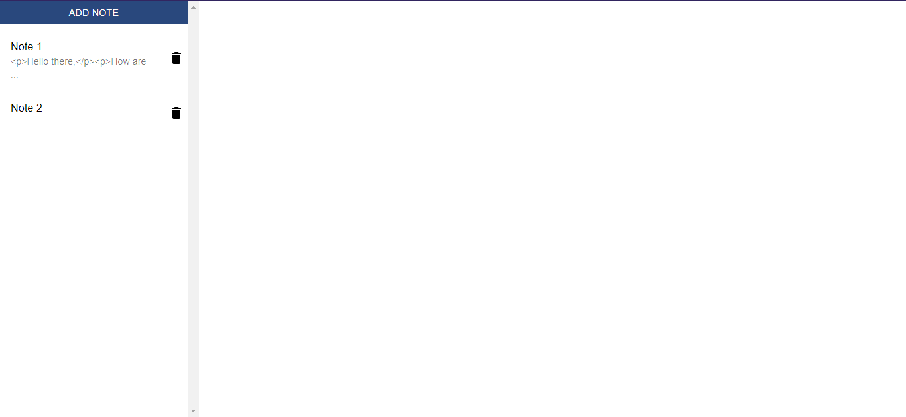
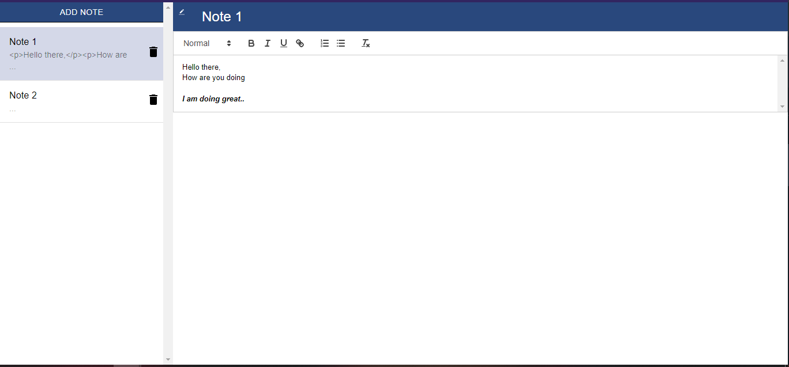

# Notelog

Notelog is a collaborative text editor and note taking application developed in React.

Multiple users can work on same note simulteneously.

For taking text input, react-quill is used which is then saved on database when user stops pressing any keys for 3 seconds

I have integrated the web application with Firebase database and hosted on netlify

## Images

1. List of notes

   

2. Editing a note

   
